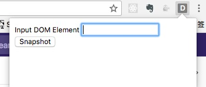

# dom-snapshot
> `chrome` 插件，针对 `DOM` 进行截图

## Install

1. 下载仓库

    $ git clone git@github.com:huang-x-h/dom-snapshot.git

2. 加载扩展程序

    打开 `chrome://extensions/` ，点击 `加载已解压的扩展程序按钮...` 选择目录

3. 点击使用

    